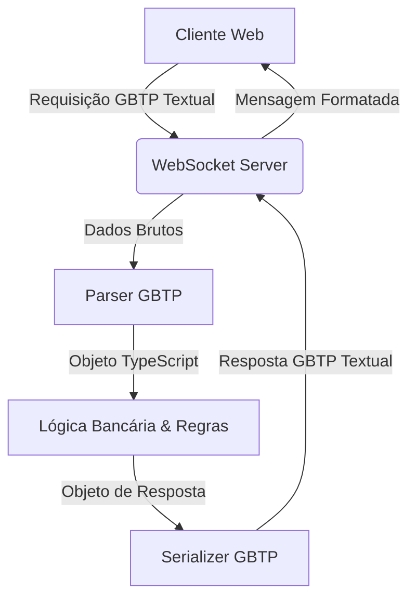

# README - Gabio Bank Transaction Protocol (GBTP)

## 📚 Disciplina
Redes de Computadores

## 👨‍🏫 Projeto
Implementação do protocolo **GBTP (Gabio Bank Transaction Protocol)** utilizando **WebSockets**, com arquitetura cliente-servidor em TypeScript.

# 🏦 Gabio Bank

Sistema bancário simplificado desenvolvido para demonstrar conceitos de:

- Protocolos da Camada de Aplicação
- Comunicação Cliente ↔ Servidor
- WebSockets
- Parsing de protocolos textuais
- Manipulação de estado no servidor
- Validação de transações

---

# 🧩 Estrutura do Projeto

```txt
/gabio-client
    Cliente Web em HTML + TypeScript

/gabio-server
    Servidor Node.js + TypeScript

README.md
    Documentação do protocolo e instruções
```

---

## 🌐 Tecnologias Utilizadas

### Backend
- **Node.js**
- **TypeScript**
- **WebSocket (ws)**

---

## 📡 Protocolo GBTP

O **GBTP (Gabio Bank Transaction Protocol)** é um protocolo textual inspirado em protocolos baseados em chave e valor.

As mensagens utilizam o formato:
```text
CHAVE:VALOR
```
Cada par chave-valor é separado por uma quebra de linha (`\n`).

### 📥 Formato das Requisições

| Campo | Descrição |
| :--- | :--- |
| **OPERATION** | Tipo da operação (`BALANCE`, `DEPOSIT`, `WITHDRAW`, `TRANSFER`) |
| **ACCOUNT_ID** | Conta principal |
| **TO_ACCOUNT_ID** | Conta destino (utilizada apenas na operação `TRANSFER`) |
| **VALUE** | Valor da operação |

#### Operações disponíveis:
- `BALANCE`
- `DEPOSIT`
- `WITHDRAW`
- `TRANSFER`

### 📤 Formato das Respostas

| Campo | Descrição |
| :--- | :--- |
| **STATUS** | `OK` ou `ERROR` |
| **MESSAGE** | Mensagem descritiva do resultado da operação |
| **BALANCE** | Saldo atualizado da conta principal |

---

## 💬 Exemplos de Comunicação

### 🔍 Consulta de Saldo
* **Requisição:**
  ```text
  OPERATION:BALANCE
  ACCOUNT_ID:1001
  TO_ACCOUNT_ID:
  VALUE:0
  ```
* **Resposta:**
  ```text
  STATUS:OK
  MESSAGE:Saldo consultado com sucesso
  BALANCE:250.00
  ```

### 💵 Depósito
* **Requisição:**
  ```text
  OPERATION:DEPOSIT
  ACCOUNT_ID:1001
  TO_ACCOUNT_ID:
  VALUE:100
  ```
* **Resposta:**
  ```text
  STATUS:OK
  MESSAGE:Depósito realizado com sucesso
  BALANCE:350.00
  ```

### 💸 Saque
* **Requisição:**
  ```text
  OPERATION:WITHDRAW
  ACCOUNT_ID:1001
  TO_ACCOUNT_ID:
  VALUE:50
  ```
* **Resposta:**
  ```text
  STATUS:OK
  MESSAGE:Saque efetuado
  BALANCE:300.00
  ```

### 🔄 Transferência
* **Requisição:**
  ```text
  OPERATION:TRANSFER
  ACCOUNT_ID:1001
  TO_ACCOUNT_ID:1002
  VALUE:75
  ```
* **Resposta:**
  ```text
  STATUS:OK
  MESSAGE:Transferência concluída
  BALANCE:225.00
  ```

---

## 🧠 Regras de Negócio

O servidor deverá validar:
1. **Existência da conta:** A conta principal e a de destino (se houver) devem estar cadastradas.
2. **Campos obrigatórios:** Presença dos campos exigidos para cada operação.
3. **Valores negativos:** Impedir operações com valores negativos ou inválidos.
4. **Saldo insuficiente:** Validar se há saldo disponível antes de efetuar saques ou transferências.
5. **Transferência para mesma conta:** Impedir transferências onde a conta de destino é idêntica à de origem.
6. **Conta destino existente:** Validar se a conta recebedora existe antes de debitar da conta de origem.

---

## 👥 Divisão do Backend (Sugerido para 3 Pessoas)

### 👨‍💻 Héber Bringel — Infraestrutura WebSocket + Servidor
* **Responsabilidades:**
  - Configurar o servidor Node.js.
  - Configurar o ambiente TypeScript.
  - Implementar o servidor WebSocket.
  - Gerenciar conexões ativas dos clientes.
  - Criar o script de inicialização do projeto.
  - Criar a base de contas fictícias iniciais.

* **Entregas:**
  - Servidor funcional.
  - Comunicação WebSocket ativa e estável.
  - Estrutura de diretórios inicial do backend.

### 👨‍💻 Micael Cardoso — Parser do Protocolo GBTP
* **Responsabilidades:**
  - Implementar o parser das mensagens brutas (`string -> objeto`).
  - Validar a formatação do protocolo textual.
  - Implementar a serialização das respostas (`objeto -> string`).
  - Definir tipos e interfaces TypeScript para o protocolo.

* **Entregas:**
  - Parser robusto e livre de falhas de formatação.
  - Tratamento correto de erros de sintaxe no protocolo.
  - Conversão bidirecional garantida (Request/Response).

### 👨‍💻 Pessoa 3 — Regras Bancárias e Operações
* **Responsabilidades:**
  - Implementar o núcleo das operações bancárias.
  - Gerenciar os saldos dos clientes em memória.
  - Implementar as validações e regras de negócio.
  - Criar a lógica de respostas para: `BALANCE`, `DEPOSIT`, `WITHDRAW` e `TRANSFER`.

* **Entregas:**
  - Lógica bancária e regras de negócio perfeitamente integradas.
  - Respostas padronizadas e validadas conforme o protocolo.

---

## 🔄 Fluxo Geral do Sistema



---

## 📂 Estrutura Recomendada do Backend

```txt
gabio-server/
│
├── src/
│   ├── comunicacao/
│   ├── data/
│   ├── protocolo/
│   ├── regras-de-negocio/
│   └── main.ts
│
├── package.json
├── tsconfig.json
└── README.md
```

---

## ▶️ Como Executar o Backend

### 1. Entrar no diretório do projeto
```bash
cd gabio-server
```

### 2. Instalar dependências
```bash
npm install
```

### 3. Compilar o projeto (Build)
```bash
npm run build
```

### 4. Executar em modo de produção
```bash
npm start
```

---

## 🧪 Contas Iniciais para Teste

| Conta | Saldo Inicial |
| :--- | :--- |
| **1001** | R$ 500.00 |
| **1002** | R$ 300.00 |
| **1003** | R$ 1000.00 |

---

## 🎯 Objetivos Acadêmicos

Este projeto busca consolidar conhecimentos sobre:
- Protocolos de aplicação personalizados
- Comunicação em tempo real em redes de computadores
- Arquitetura de sistemas cliente-servidor
- Integração robusta com WebSockets
- Parsing e estruturação textual de dados
- Desenvolvimento tipado com TypeScript
- Organização e modularização de software profissional